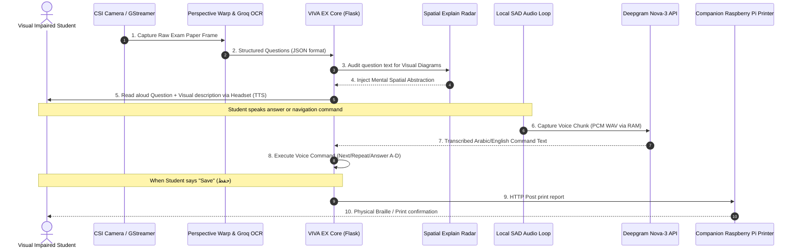
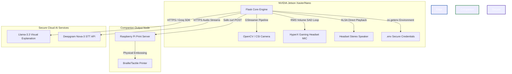

# VIVA EX — Edge-AI Multimodal Exam & Study Ecosystem for Visually Impaired Students 🚀

<div align="center">
  <h3>🎙️ Edge-Computing • Multimodal Vision • Real-Time Speech • Spatial/Visual Radar</h3>
  <p><strong>Built on NVIDIA Jetson & Python Edge Orchestration</strong></p>
  <hr />
</div>

---

## 🌟 Overview / نبذة عن المشروع

**VIVA EX** is a revolutionary, edge-computing multimodal platform designed to empower blind and visually impaired students to study and sit for written exams **with 100% independence**, eliminating the need for human proctors, scribes, or special visual companions.

Through an elegant orchestration of **Computer Vision, Local Speech Activity Detection (SAD), Generative AI (LLMs), and Low-Latency Edge Audio pipelines**, VIVA EX scans standard printed A4 exam sheets, translates visual layouts into structured speech, explains visual charts mentally, and parses voice answers in real-time.

---

## 🇸🇦 القيمة الابتكارية للمشروع (باللغة العربية)

مشروع **VIVA EX** هو نظام ذكاء اصطناعي تفاعلي متكامل يعمل على معالجة الحواف (Edge Computing) عبر لوحات **NVIDIA Jetson**. يهدف النظام إلى تمكين الطلاب المكفوفين وضعاف البصر من تقديم الامتحانات والدراسة **باستقلالية تامة بنسبة 100%** ودون الحاجة لأي مساعد بشري، من خلال دمج تقنيات متعددة:

* **رادار التخيل المكاني الذكي (Spatial Explain Engine):** يكتشف النظام وجود الرسومات الهندسية، المعادلات، الجداول، أو الخرائط التوضيحية في الامتحان ويقوم بتوليد وصف مكاني دقيق جداً بصرياً ورياضياً ليتمكن الطالب الكفيف من رسم صورة ذهنية للمسألة وحلها بسهولة!
* **المعالجة الصوتية الذاتية (Local Speech Activity Detection):** يلتقط صوت الطالب من خلال سماعة الرأس ويقوم بتحليل مستويات الصوت تلقائياً لتجنب الضوضاء المحيطة.
* **التحكم الصوتي الكامل (Bilingual Voice Commands):** تفاعل كامل بدون لمس الشاشة باللغتين العربية والإنجليزية للتنقل والإجابة والتعديل.
* **المسح الضوئي الذكي (Edge Vision):** التقاط أوراق الامتحانات المطبوعة بواسطة كاميرا Jetson ومعالجتها باستخدام خوارزميات تصحيح الأبعاد لاستخراج الأسئلة وتنسيقها.

---

## ✨ Core Intelligent Modules / الأنظمة الذكية الأساسية

### 1. 👁️ GStreamer CSI Camera Perspective Scanner (Vision Edge)
Utilizes an onboard **NVIDIA Jetson Camera** (USB/CSI camera pipeline with hardware-accelerated GStreamer) to capture physical paper exams. A warp-perspective algorithm crops and flattens the document to exact A4 dimensions, followed by high-accuracy OCR extraction and generative JSON question structuring via **Llama-3.3-70b-versatile**.

### 2. 🎙️ Edge Speech Activity Detection (SAD)
Employs a custom, asynchronous, hardware-integrated audio recording loop running on **sounddevice** and **NumPy**. It auto-detects USB/ALSA interfaces (like HyperX Headsets), calculates Root-Mean-Square (RMS) audio energy, and triggers speech segments based on voice activity and dynamic silence frames.

### 3. 🧠 Spatial Visual Map Radar (`/api/ai_explain`)
* **Our Crowning Innovation:** When a scanned question contains keywords representing visual or spatial elements (e.g., *map, diagram, table, chart, triangle, square, equation*), VIVA EX automatically launches the **Spatial Radar**.
* The system calls a specialized prompt on Groq to compile a **3D-tactile mental description** of the visual asset, reading it aloud to the student so they can mentally "see" and visualize the drawing.

### 4. 🗣️ Real-Time Bilingual Dialog Engine (Arabic/English STT & TTS)
Orchestrates low-latency **Deepgram Nova-3 API** for lightning-fast speech-to-text (highly optimized for Arabic and English regional accents) and synthesizes speech responses back to the local headphones using ALSA output (`aplay -D plughw:{card_num},0`).

### 5. 🖨️ Physical Tactile Companion (Raspberry Pi Printing)
Integrates with a secondary local server running on a **Raspberry Pi** via safe curl payloads to automatically print/emboss tactile answer reports once the student verbally triggers "Save" (حفظ).

---

## 🔄 Multimodal AI Pipeline / مخطط تدفق البيانات المعالج بالذكاء الاصطناعي



---

## 🏗️ System Hardware Architecture / هيكلية الاتصال المادية للنظام



---

## 🛠️ Technologies Used / التقنيات المستخدمة

### Frontend & Interface
* **HTML5 & Vanilla CSS3:** Premium design with interactive status badges indicating Microphone state.
* **JavaScript (Fetch & Events):** Handles high-frequency polling from Jetson ALSA status endpoints.
* **PDFJS Library:** Serves as a local rendering fallback for teacher interfaces.

### Backend & Audio Loop
* **Python Flask Framework:** Lightweight, high-throughput edge routing.
* **Sounddevice & NumPy:** High-performance hardware loop calculations for sound levels.
* **OpenCV & GStreamer:** Captures and rotates high-definition video frames locally at low CPU loads.

### AI Engines
* **Groq Llama-3.3-70b-versatile:** Extracts exam tables/geometry and generates spatial descriptions.
* **Deepgram Nova-3 API:** Ultra-low latency voice transcriber with specialized Arabic parsing.
* **Google Text-To-Speech (gTTS) & FFMPEG:** Offline WAV rendering played on Edge ALSA cards.

---

## 📂 Public Repository Structure / هيكل المستودع العام

```text
viva-ex-public-repo/
│
├── backend/
│   └── app_jetson_local.py    # Public backend exposing vision and local sound SAD loops
│
├── frontend/
│   └── index.html             # Sleek frontend template with interactive Speech HUD
│
├── .gitignore                 # Excludes credentials, caches, logs, and wav audio files
├── .env.example               # Secure placeholder variables template for easy setup
└── README.md                  # Beautiful bilingual interactive presentation
```

---

## 🚀 Setup & Installation / خطوات التشغيل للمحكمين

### 1. Pre-requisites & Audio Dependencies
Install ALSA audio libraries and visual dependencies on your local machine or NVIDIA Jetson:
```bash
sudo apt-get install portaudio19-dev ffmpeg libgstreamer1.0-dev opencv-data
```

### 2. Environment Configuration
Clone this repository, duplicate `.env.example` into `.env`, and insert your credentials securely:
```bash
cp .env.example .env
```
Edit `.env` and fill:
* `GROQ_API_KEY=your_secure_groq_key`
* `DEEPGRAM_API_KEY=your_secure_deepgram_key`

### 3. Install Python Dependencies
```bash
pip install flask sounddevice soundfile numpy requests python-dotenv gTTS
```

### 4. Run the Engine
Launch the Flask backend core:
```bash
python backend/app_jetson_local.py
```
Open `frontend/index.html` in your browser to experience the visual voice panel!

---

## 📈 Future Milestones / الرؤية المستقبلية للمشروع

* [ ] **Local LLM Fine-Tuning:** Fine-tuning Llama-3.2-3B locally on the Jetson to run the Spatial Explain Radar completely **100% offline** with zero internet connection.
* [ ] **CSI Stereo Depth Integration:** Implementing dual camera vision to detect distance and emboss coordinates automatically.
* [ ] **Multi-Agent Companion System:** Integrating ROS robots to physically navigate visually impaired students to the exam hall and seat them.

---

## 👨‍💻 University & Authors Meta

* **Academic Institution:** Amman Arab University (جامعة عمان العربية)
* **Supervisor:** Lial Alzabin (أ. ليال الزبن)
* **License:** This project is released for educational, academic, and research competition purposes.
