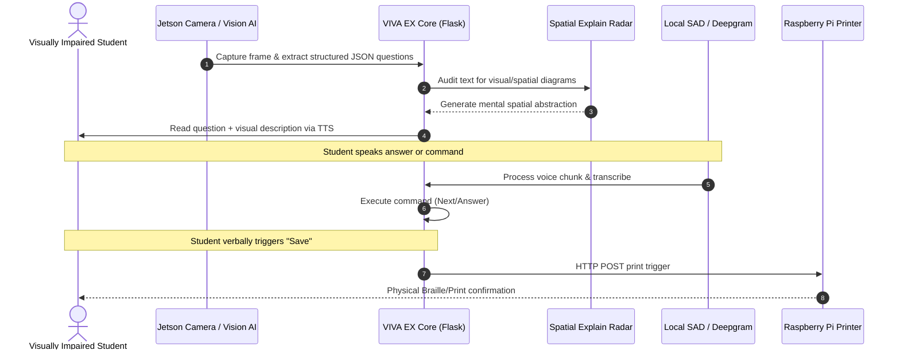
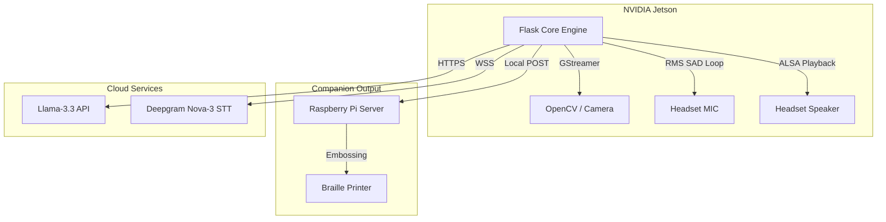

```markdown
# VIVA EX — Edge-AI Exam Ecosystem for Visually Impaired Students

**Edge-Computing • Multimodal Vision • Real-Time Speech • Spatial/Visual Radar**
Built on NVIDIA Jetson & Python Edge Orchestration

---

## Overview

VIVA EX is an edge-computing multimodal platform designed to empower visually impaired students to take written exams independently. By eliminating the need for human proctors or scribes, the system provides a fully autonomous examination experience. 

Using a combination of Computer Vision, Local Speech Activity Detection (SAD), Large Language Models (LLMs), and low-latency audio pipelines, VIVA EX scans standard printed A4 exams, translates visual layouts into structured speech, explains visual charts, and processes voice answers in real-time.

---

## Core System Modules

### 1. GStreamer CSI Camera Pipeline (Vision Edge)
Utilizes an onboard NVIDIA Jetson Camera (USB/CSI via hardware-accelerated GStreamer) to capture physical paper exams. A warp-perspective algorithm crops and flattens the document to A4 dimensions, followed by OCR extraction and structured JSON formatting via Llama-3.3-70b-versatile.

### 2. Edge Speech Activity Detection (SAD)
A custom, asynchronous audio recording loop built with `sounddevice` and `NumPy`. It interfaces directly with ALSA devices (e.g., USB headsets), calculates Root-Mean-Square (RMS) audio energy, and segments speech dynamically based on voice activity and silence thresholds.

### 3. Spatial Visual Mapping
When a scanned question contains spatial elements (e.g., map, diagram, table, triangle, equation), VIVA EX triggers the Spatial Radar. It compiles a 3D-tactile mental description of the visual asset and reads it aloud, allowing the student to conceptualize the drawing geometry.

### 4. Real-Time Bilingual Dialog Engine
Integrates the Deepgram Nova-3 API for low-latency speech-to-text (optimized for regional dialects) and synthesizes audio responses back to the local headphones using direct ALSA output (`aplay -D plughw:{card_num},0`).

### 5. Physical Tactile Companion 
Communicates with a secondary local Raspberry Pi server via HTTP POST payloads to automatically print or emboss tactile answer reports when the student triggers the verbal "Save" command.

---

## Multimodal AI Pipeline



---

## Hardware Architecture



---

## Technologies Used

* **Frontend:** HTML5, CSS3, JavaScript (Fetch API for ALSA polling), PDFJS.
* **Backend:** Python, Flask, Sounddevice, NumPy, OpenCV, GStreamer.
* **AI & Audio:** Llama-3.3-70b-versatile, Deepgram Nova-3, gTTS, FFmpeg.

---

## Repository Structure

```text
viva-ex/
├── backend/
│   └── app_jetson_local.py    # Main Flask backend and SAD loops
├── frontend/
│   └── index.html             # Client interface with interactive Speech HUD
├── .gitignore                 
├── .env.example               # Template for environment variables
└── README.md                  

```

---

## Setup & Installation

### 1. Audio & Vision Dependencies

Install ALSA and GStreamer libraries on your Jetson or local Linux machine:

```bash
sudo apt-get update
sudo apt-get install portaudio19-dev ffmpeg libgstreamer1.0-dev opencv-data

```

### 2. Environment Variables

Copy the environment template and add your API keys:

```bash
cp .env.example .env

```

Ensure you populate `GROQ_API_KEY` and `DEEPGRAM_API_KEY` in the `.env` file.

### 3. Python Requirements

```bash
pip install flask sounddevice soundfile numpy requests python-dotenv gTTS

```

### 4. Run the Platform

Start the backend server:

```bash
python backend/app_jetson_local.py

```

Open `frontend/index.html` in your browser to access the dashboard.

---

## Future Milestones

* **Local LLM Execution:** Fine-tuning Llama-3.2-3B to run natively on the Jetson, enabling the Spatial Explain Radar to function 100% offline.
* **Stereo Depth Integration:** Adding CSI dual-camera support to detect document distance and dynamically adjust OCR focal points.
* **Multi-Agent Companion:** Integrating ROS to help physically guide students to their exam desks, utilizing precise servo robot connections for accurate movement and haptic feedback.

```

```
